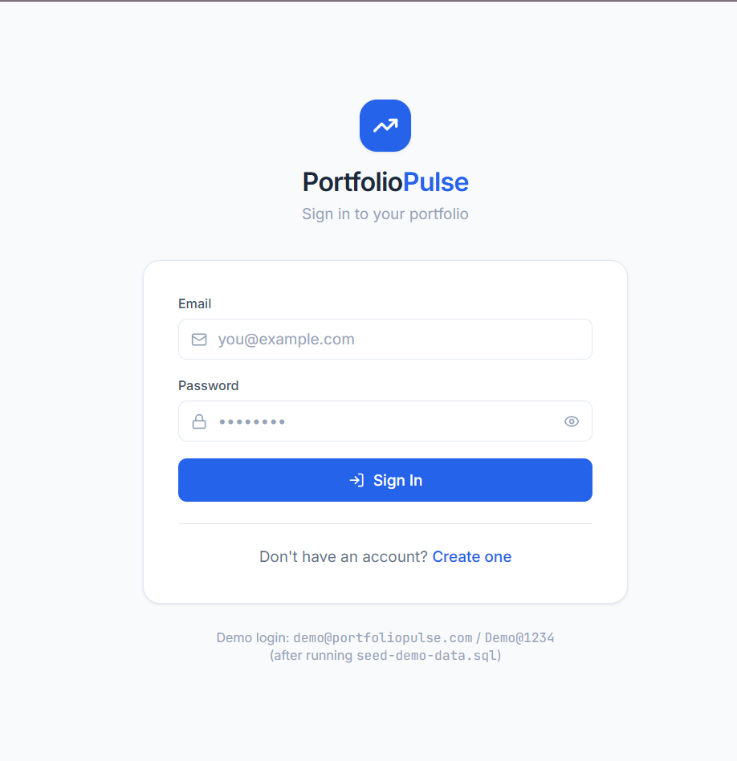
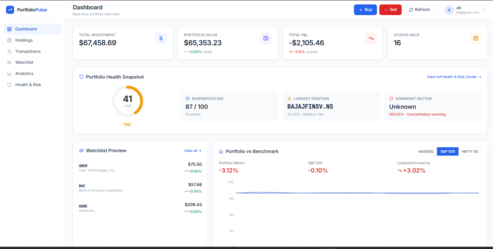
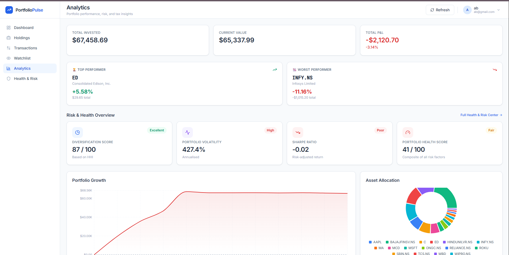
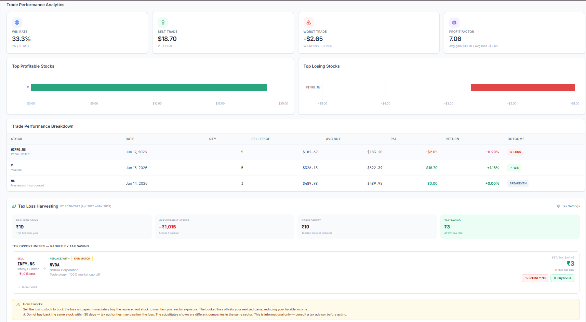

# PortfolioPulse

A full-stack stock portfolio analytics platform that tracks investments, analyzes risk, enforces market hours, and delivers actionable financial insights — including an automated tax loss harvesting engine. Built with Spring Boot and React, featuring JWT authentication, live Yahoo Finance integration, and a multi-user architecture.

## Screenshots

<p align="center">
  
  
</p>

<p align="center">
  
  
</p>
---

## Tech Stack

**Backend** — Java 17 · Spring Boot 3.2 · Spring Security · Spring Data JPA · Hibernate · MySQL 8 · Maven

**Frontend** — React 18 · TypeScript · Vite · Tailwind CSS · Recharts · Axios · React Router

**Security** — JWT (JJWT 0.12) · BCrypt · Stateless REST API

**External API** — Yahoo Finance (live quotes, historical prices, sector/industry data)

---

## Features

### Authentication & Multi-User Support

- JWT-based registration and login with BCrypt password hashing
- Stateless authentication with role-based access control (USER / ADMIN)
- All data scoped per user via foreign keys — multiple users on the same database never see each other's portfolios
- Session-based token storage: users must log in on every fresh browser launch (shared machine friendly)

### Portfolio Dashboard

- Real-time portfolio value, total P&L, day change, and return %
- Portfolio growth area chart with invested cost baseline
- Asset and sector allocation donut charts
- Top holdings table with live prices
- Portfolio health snapshot card with health score ring
- Watchlist preview widget
- Portfolio vs Benchmark card (S&P 500 / NASDAQ / NIFTY 50) with normalized growth comparison chart
- Auto-refresh every 180 seconds with immediate refresh on tab return — no memory leaks

### Holdings & Transactions

- Buy and sell stocks with weighted-average cost basis recalculated on every purchase
- Full transaction history with date, price, quantity, and notes
- Searchable holdings table with live P&L per position

### Stock Catalog & Smart Search

- 281-symbol catalog pre-seeded automatically on first startup: S&P 500 leaders, Nasdaq 100 leaders, and Nifty 50 (NSE)
- Debounced keyboard-navigable autocomplete in Buy/Sell modal — search by ticker or company name
- Selecting a stock auto-populates symbol, company name, sector, and current live price
- Sector data resolved from local catalog first (zero latency, no rate limits), falls back to Yahoo Finance for unknown symbols

### Watchlist

- Track stocks without owning them — live price, day change %, and trend indicator
- Quick Buy button and Yahoo Finance chart link per stock
- Dashboard widget shows top watchlist items at a glance

### Market Hours Enforcement

- Live trades validated against real exchange trading hours before submission
- **NSE/BSE**: 09:15–15:30 IST (Asia/Kolkata) — detected from `.NS` / `.BO` symbol suffix
- **NASDAQ/NYSE**: 09:30–16:00 ET (America/New_York) — all other symbols
- Live market status badge in the trade modal shows open/closed state before submission
- Confirm button disabled when market is closed in Live Trade mode
- **Log Past Trade mode** bypasses all time restrictions — record any historical transaction at any date and price

### Portfolio Health & Risk Center

A quantitative risk dashboard built without any external AI or analytics APIs:

| Metric                        | Methodology                                                                                                      |
| ----------------------------- | ---------------------------------------------------------------------------------------------------------------- |
| Diversification Score (0–100) | Herfindahl-Hirschman Index (HHI) across position weights                                                         |
| Portfolio Volatility          | Annualized standard deviation of daily snapshot returns (σ × √252)                                               |
| Sharpe Ratio                  | `(Portfolio Return − 5% risk-free rate) / Volatility`                                                            |
| Health Score (0–100)          | Weighted composite: diversification 30%, volatility 25%, Sharpe 25%, position risk 10%, sector concentration 10% |
| Sector Exposure               | Horizontal bar chart with 40% concentration warning threshold                                                    |
| AI Insights                   | 10 deterministic rule-based insights — no external APIs                                                          |

### Benchmark Comparison

- Compare portfolio return vs. S&P 500, NASDAQ, or NIFTY 50
- Historical price series fetched from Yahoo Finance, normalized to base 100 for side-by-side chart comparison
- Outperformance and tracking difference calculated and displayed

### Trade Performance Analytics

- Win rate, profit factor, average gain/loss
- Best and worst realized trade
- Top profitable and top losing stocks (horizontal bar charts)
- Full realized trade breakdown table with outcome badges (WIN / LOSS / BREAKEVEN)

### Tax Loss Harvesting

An automated tax saving engine built entirely from portfolio data — no external APIs, no hardcoding, no AI:

**What it does:**
Scans your portfolio every time you open Analytics. Finds stocks sitting at a loss that you could sell to offset profits you've already made this year, then suggests a replacement stock in the same sector so you stay invested.

**How the engine works:**

1. Sums all realized gains from SELL transactions since the start of the current financial year using weighted-average cost basis
2. Scans current holdings for positions with unrealized loss greater than ₹500
3. For each losing position, queries `stock_catalog` for the best substitute: same sector, closest market cap, not already owned by the user
4. Calculates tax saving = `loss × tax rate`, capped at remaining realized gains
5. Ranks top 5 opportunities by tax saving and shows them with one-click Sell/Buy actions

**Example:**

> You realized ₹82,000 profit selling NVIDIA this year.
> You currently hold Intel at a ₹18,000 loss.
> Sell Intel → immediately buy AMD (same sector, similar market cap).
> Taxable gain drops from ₹82,000 to ₹64,000. Tax saved: ₹2,700 at 15%.

**User configurable:**

- Tax rate: 10% / 15% / 30% (covers India LTCG, STCG, debt slabs and US equivalents)
- Financial year: APR start (India, April–March) or JAN start (US/international, January–December)
- Settings panel recalculates all opportunities instantly on save

**Substitute quality rating:** EXCELLENT (< 10% market cap difference) · GOOD (10–30%) · FAIR (> 30%)

**Important:** The app warns users not to repurchase the same stock within 30 days (wash sale rule). Substitute stocks are always different companies in the same sector. All calculations are informational — users are advised to consult a tax advisor.

---

## Architecture

```
┌──────────────────────────────────────────────────────┐
│                   React Frontend                       │
│  8 pages · 18+ components · 6 Recharts visuals        │
│  JWT via sessionStorage · Axios interceptors           │
└─────────────────────┬────────────────────────────────┘
                      │ REST (JSON)
┌─────────────────────▼────────────────────────────────┐
│              Spring Boot Backend                       │
│  10 controllers · 12 services · 7 JPA entities        │
│  Spring Security filter chain · JWT validation         │
└──────────┬───────────────────────┬────────────────────┘
           │                       │
┌──────────▼──────────┐  ┌─────────▼──────────────────┐
│      MySQL 8         │  │   Yahoo Finance API          │
│  7 tables, FK-linked │  │   Live quotes · History      │
│  per-user isolation  │  │   5-min in-memory cache      │
└─────────────────────┘  └────────────────────────────┘
```

**Backend layers:** Controller → Service → Repository → Entity, with a shared DTO layer for all API contracts and a centralized `GlobalExceptionHandler` returning structured JSON errors.

**Security flow:** Every request passes through `JwtAuthenticationFilter` → `CustomUserDetailsService` → `SecurityContextHolder`. Services call `SecurityUtils.getCurrentUserId()` to scope all queries to the authenticated user — the frontend never sends a user ID explicitly.

---

## Database Schema

| Table                 | Purpose                                                              | Key Constraints                  |
| --------------------- | -------------------------------------------------------------------- | -------------------------------- |
| `users`               | Accounts, BCrypt passwords, roles                                    | `email` UNIQUE                   |
| `holdings`            | Current positions with weighted-avg cost                             | `UNIQUE(user_id, symbol)`        |
| `transactions`        | Full buy/sell history                                                | FK → users (CASCADE)             |
| `portfolio_snapshots` | Daily value history for charts, volatility, benchmarks               | `UNIQUE(user_id, snapshot_date)` |
| `stock_catalog`       | 281-symbol reference catalog for autocomplete and substitute finding | `symbol` UNIQUE                  |
| `watchlist`           | Per-user tracked stocks                                              | `UNIQUE(user_id, symbol)`        |
| `tax_settings`        | Per-user tax rate and financial year preference                      | PK = user_id                     |

---

## REST API Reference

| Area         | Method | Endpoint                        | Description                                        |
| ------------ | ------ | ------------------------------- | -------------------------------------------------- |
| Auth         | POST   | `/api/auth/register`            | Create account → returns JWT + user                |
| Auth         | POST   | `/api/auth/login`               | Authenticate → returns JWT + user                  |
| Auth         | GET    | `/api/auth/me`                  | Current user profile                               |
| Dashboard    | GET    | `/api/dashboard`                | KPIs, top holdings, growth, allocation             |
| Holdings     | GET    | `/api/holdings`                 | All holdings with live P&L                         |
| Holdings     | POST   | `/api/holdings/buy`             | Record a buy (market hours enforced for LIVE mode) |
| Holdings     | POST   | `/api/holdings/sell`            | Record a sell                                      |
| Transactions | GET    | `/api/transactions`             | Full transaction history                           |
| Analytics    | GET    | `/api/analytics`                | P&L, allocation, top/worst performer               |
| Analytics    | GET    | `/api/analytics/risk`           | Portfolio Health & Risk Center                     |
| Analytics    | GET    | `/api/analytics/benchmark`      | vs S&P 500 / NASDAQ / NIFTY 50                     |
| Analytics    | GET    | `/api/analytics/trades`         | Win rate, profit factor, trade breakdown           |
| Watchlist    | GET    | `/api/watchlist`                | List with live prices                              |
| Watchlist    | POST   | `/api/watchlist`                | Add a symbol                                       |
| Watchlist    | DELETE | `/api/watchlist/{id}`           | Remove an entry                                    |
| Catalog      | GET    | `/api/stocks/catalog`           | Full 281-symbol catalog                            |
| Catalog      | GET    | `/api/stocks/catalog/search?q=` | Autocomplete by symbol or company name             |
| Catalog      | GET    | `/api/stocks/catalog/{symbol}`  | Catalog metadata + live quote                      |
| Stocks       | GET    | `/api/stocks/{symbol}`          | Live Yahoo Finance quote                           |
| Market       | GET    | `/api/market/status?symbol=`    | Real-time open/closed status for any exchange      |
| Tax          | GET    | `/api/tax/opportunities`        | Full tax loss harvesting analysis                  |
| Tax          | GET    | `/api/tax/settings`             | User's tax rate and FY preference                  |
| Tax          | POST   | `/api/tax/settings`             | Save tax rate and FY preference                    |

---

## Setup

### Requirements

Java 17+ · Maven 3.8+ · MySQL 8 · Node 18+ · npm 9+

### 1 — Database

```bash
# Create schema (7 tables)
mysql -u root -p < backend/src/main/resources/schema.sql
```

> The stock catalog (281 symbols) seeds automatically on first backend startup. No manual step needed.
> For the tax_settings table, it is included in schema.sql. If upgrading from an older version, run:
> `mysql -u root -p portfoliopulse < backend/src/main/resources/migration-add-tax-settings.sql`

### 2 — Backend Configuration

```properties
# backend/src/main/resources/application.properties
spring.datasource.url=jdbc:mysql://localhost:3306/portfoliopulse
spring.datasource.username=YOUR_USER
spring.datasource.password=YOUR_PASSWORD
```

Optional:

```bash
JWT_SECRET=<random string, 32+ bytes>     # default provided for dev only
JWT_EXPIRATION_MS=86400000                 # 24 hours
```

### 3 — Start Backend

```bash
cd backend
mvn clean install -DskipTests
mvn spring-boot:run
# Starts on http://localhost:8080
```

Watch for:

```
Seeded stock_catalog with 281 symbols.
Sector backfill: all holdings have sector data — nothing to do.
```

### 4 — Start Frontend

```bash
cd frontend
npm install
npm run dev
# Starts on http://localhost:5173
```

### 5 — Optional: Load Demo Portfolio

```bash
mysql -u root -p portfoliopulse < backend/src/main/resources/seed-demo-data.sql
```

Creates a demo user with 15 holdings across 4 sectors, 54 transactions, and 45 days of growth history. The Technology sector is intentionally overweight (~54%) so Health & Risk Center warnings and Tax Harvesting opportunities are visible immediately.

```
Email:    demo@portfoliopulse.com
Password: Demo@1234
```

---

## Project Structure

```
portfoliopulse/
├── backend/src/main/
│   ├── resources/
│   │   ├── schema.sql                         # complete schema, 7 tables
│   │   ├── seed-stock-catalog.sql             # manual catalog seed (optional)
│   │   ├── seed-demo-data.sql                 # demo portfolio (optional)
│   │   ├── seed/stock-catalog-seed.txt        # pipe-delimited data for StockCatalogSeeder
│   │   ├── migration-add-tax-settings.sql     # for upgrades from older schema
│   │   └── migration-fix-holdings-unique-constraint.sql
│   └── java/com/portfoliopulse/
│       ├── config/
│       │   ├── SecurityConfig.java            # Spring Security + CORS + JWT filter chain
│       │   ├── JacksonConfig.java
│       │   ├── StockCatalogSeeder.java        # self-healing startup seeder (Order 1)
│       │   └── SectorBackfillRunner.java      # fixes null sectors on startup (Order 2)
│       ├── security/
│       │   ├── JwtUtil.java                   # token generation and validation
│       │   ├── JwtAuthenticationFilter.java   # reads Bearer token, sets SecurityContext
│       │   ├── CustomUserDetailsService.java
│       │   ├── UserPrincipal.java
│       │   ├── AuthEntryPointHandler.java     # JSON 401/403 responses
│       │   └── SecurityUtils.java             # getCurrentUserId() helper
│       ├── entity/
│       │   # User, Holding, Transaction, PortfolioSnapshot,
│       │   # StockCatalog, Watchlist, TaxSettings
│       ├── repository/                        # Spring Data JPA (one per entity)
│       ├── dto/                               # all request/response contracts
│       ├── exception/                         # custom exceptions + GlobalExceptionHandler
│       ├── service/
│       │   ├── AuthService.java
│       │   ├── HoldingService.java            # buy/sell, weighted-avg cost, market hours check
│       │   ├── TransactionService.java
│       │   ├── AnalyticsService.java          # daily snapshots, P&L, allocations
│       │   ├── PortfolioRiskService.java      # HHI, volatility, Sharpe, health score, insights
│       │   ├── BenchmarkService.java          # portfolio vs index comparison
│       │   ├── TradeAnalyticsService.java     # win rate, profit factor, best/worst trade
│       │   ├── TaxHarvestingService.java      # tax loss harvesting engine
│       │   ├── MarketHoursService.java        # exchange hours validation with timezone
│       │   ├── StockCatalogService.java
│       │   ├── WatchlistService.java
│       │   └── YahooFinanceService.java       # live quotes, historical prices, caching
│       └── controller/                        # 10 REST controllers
└── frontend/src/
    ├── api/client.ts                          # Axios instance, JWT interceptor, all endpoints
    ├── context/AuthContext.tsx                # JWT lifecycle, session-scoped storage
    ├── hooks/useAutoRefresh.ts                # 180s polling + visibility refresh + cleanup
    ├── components/
    │   ├── auth/ProtectedRoute.tsx
    │   ├── layout/                            # Sidebar, Header, AppLayout
    │   ├── charts/                            # Growth, Allocation, Performance, Sector,
    │   │                                      # Benchmark, TopStocks charts
    │   └── ui/                                # StatCard, TradeModal (LIVE/MANUAL modes),
    │                                          # StockSelector, WatchlistPreview,
    │                                          # BenchmarkCard, TradeAnalyticsSection,
    │                                          # TaxHarvestingSection, HealthScoreRing,
    │                                          # InsightCard, UserMenu
    └── pages/
        # Login, Register, Dashboard, Holdings,
        # Transactions, Watchlist, Analytics, HealthCenter
```

---

## Key Implementation Details

**Market hours enforcement with two modes** — `MarketHoursService` converts current UTC time to the stock's exchange timezone using `java.time.ZoneId`. The `TransactionRequestDto` carries a `transactionMode` field (`LIVE` or `MANUAL`). `HoldingService` checks the mode before calling `assertMarketOpen()` — MANUAL transactions bypass all time checks completely, enabling historical record-keeping without restrictions.

**Tax harvesting substitute finder** — `StockCatalogRepository.findSubstitutes()` is a JPQL query that filters by same sector, excludes symbols the user already owns, and orders by `ABS(marketCap - targetMarketCap)` ascending. This gives the closest market cap match in one database query with no application-side sorting needed.

**Sector resolution strategy** — `YahooFinanceService` checks `StockCatalogRepository.findBySymbolIgnoreCase()` first on every `getStockInfo()` call. If the symbol is in the 281-symbol catalog, sector comes from the database instantly. Only for unlisted symbols does it attempt Yahoo Finance's `v10/quoteSummary?modules=assetProfile`. This eliminates rate-limit exposure for the vast majority of trades.

**Auto-refresh without skeleton flicker** — Dashboard load functions accept a `silent` boolean. Background refreshes (180s timer, tab visibility return) call `load(true)` which updates state but skips the `setLoading(true)` toggle, so numbers update in place. The manual Refresh button calls `load(false)` for normal loading feedback.

**Self-healing startup** — `StockCatalogSeeder` (Order 1) runs at startup and seeds 281 symbols if the table is empty. `SectorBackfillRunner` (Order 2) finds all holdings where `sector IS NULL`, checks the catalog first, then Yahoo Finance as a fallback. Both are idempotent — they no-op on every subsequent startup once data exists.

**Daily portfolio snapshots** — Taken on first dashboard load each day and via a `@Scheduled` job at 21:00 UTC (post US market close). Snapshots are used for the growth chart, annualized volatility calculation (`σ_daily × √252`), and benchmark return alignment.

---

## Author

**Parth Shinde**

## License

This project is licensed under the MIT License. See the LICENSE file for details.
